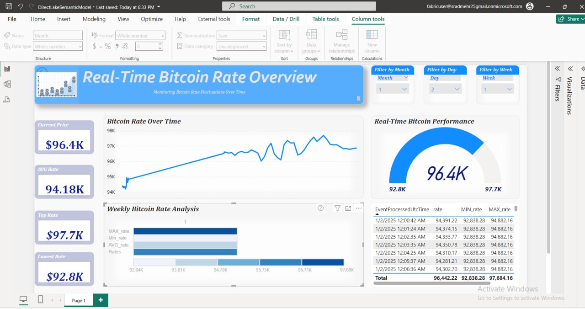

# Real-Time Bitcoin Dashboard

## Overview
This project retrieves real-time Bitcoin price data from an API and processes it using a Microsoft Fabric notebook. The data is sent to an Event Hub for further real-time analytics and visualization. Using Event Stream, the data is transferred to a Lakehouse for storage and analysis. Instead of creating measures in Power BI, managed fields were utilized for seamless integration.

Due to API request limitations, the notebook was scheduled to run every 20 minutes instead of every minute. The project faced several challenges, but they were resolved through continuous effort and troubleshooting.

## Power BI Visualizations
The dashboard provides:
1. Real-time tracking of Bitcoin prices.
2. Visual analytics of minimum, maximum, average, and current rates.
3. Weekly and daily breakdowns of Bitcoin price trends.

## Features
Real-time retrieval and processing of Bitcoin price data from an API.
Integration with Microsoft Fabric for efficient data ingestion and processing.
Real-time analytics and visualization using Event Hub and Power BI.
Automatic scheduling of data retrieval due to API request limitations.
Managed fields in Power BI for seamless integration without manual measure creation.
Interactive dashboard providing insights such as:
Current, minimum, maximum, and average Bitcoin rates.
Weekly and daily trend analysis of Bitcoin prices.
Real-time performance tracking.

## Preview

### Power BI File
The `DirectLakeSemanticModel.pbix` file contains the Power BI dashboard for real-time Bitcoin price analytics. To open this file:
1. Download the `.pbix` file to your local machine.
2. Open it using Microsoft Power BI Desktop.

