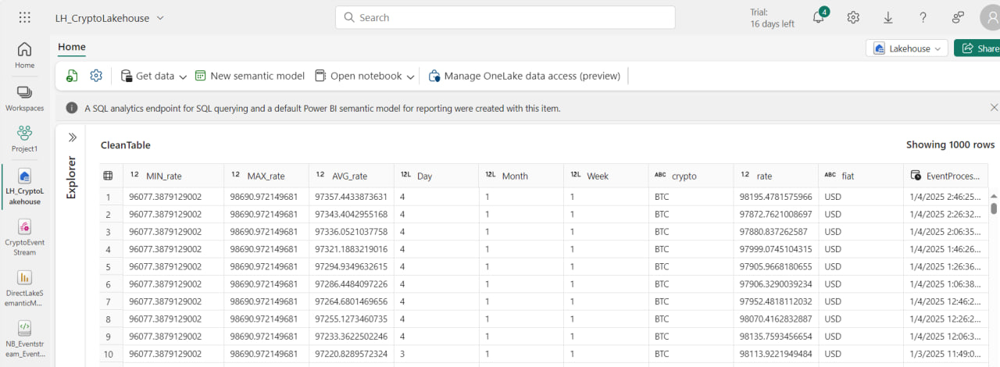

# Real-Time Bitcoin Dashboard

## Overview

The **Real-Time Bitcoin Dashboard** addresses the need for real-time cryptocurrency price tracking and analysis. By leveraging **Microsoft Fabric** and **Power BI**, it creates a seamless pipeline that retrieves, processes, and visualizes Bitcoin price data in real time.

This project is designed for:
- **Cryptocurrency analysts** looking for actionable insights.
- **Traders** needing real-time updates for decision-making.
- **Enthusiasts** eager to understand Bitcoin price trends.

### Key Benefits:
- **Instant access** to live Bitcoin price data.
- **Comprehensive analytics** for trend evaluation.
- **Reliable decision-making** through real-time insights.

---

### Power BI Service Export: DirectLakeSemanticModel.Report

This repository includes the **DirectLakeSemanticModel.Report** folder, synchronized directly from Microsoft Fabric to GitHub. The folder contains JSON files and metadata representing the Power BI dashboard configuration.

#### Contents of DirectLakeSemanticModel.Report
- **definition.pbix**: Metadata describing the structure of the Power BI report.
- **report.json**: Detailed JSON configuration of the report, including visuals, layouts, and data sources.
- **StaticResources folder**: Additional assets supporting the dashboard.

#### Purpose
Including these files provides:
1. **Configuration Review**: Analyze the report's structure and setup through JSON files.
2. **Version Control**: Collaborate efficiently by tracking changes via GitHub.
3. **Documentation**: Ensure transparency of the dashboard’s design and logic.

By exporting directly from Microsoft Fabric to GitHub, this repository integrates the development and deployment of Power BI dashboards into a modern, collaborative workflow.

---

## Power BI Visualizations

The dashboard provides:
1. Real-time tracking of Bitcoin prices.
2. Visual analytics for:
   - Minimum, maximum, average, and current rates.
3. Weekly and daily breakdowns of Bitcoin price trends.

---

## Technology Stack

This project leverages the following technologies:
- **Microsoft Fabric**: For seamless integration of data ingestion, processing, and storage.
- **Azure Event Hub**: To manage real-time data streaming efficiently.
- **Python**: For scripting and API integration.
- **Power BI**: To create interactive dashboards for data visualization.
- **Event Stream**: To process and transfer real-time data to the Lakehouse.
- **Lakehouse**: For centralized storage and analysis of processed data.
- **Data Activator**: For automated alerts and real-time monitoring.

---

## Features

- **Real-time Bitcoin price retrieval** using a public API.
- **Integration with Microsoft Fabric** for efficient data processing and storage.
- **Streaming data with Azure Event Hub** for real-time analytics.
- **Interactive Power BI dashboard** to visualize price trends.
- **Automated Alerts** with Data Activator:
  - Notifies when:
    - **Minimum price drops below $90,000.**
    - **Maximum price exceeds $98,000.**
  - Sends alerts via **email** for actionable insights.

---

## Data Flow

### 1. Source Data (API)
- Retrieves real-time Bitcoin price data.

### 2. Event Stream
- Streams data using Azure Event Hub.
- Processes data with Event Stream for analytics.

### 3. Managed Fields
- Adds fields like:
  - **Day**
  - **Month**
  - **Week**

### 4. Aggregation
- Calculates:
  - **Minimum Price**
  - **Maximum Price**
  - **Average Price**

### 5. Data Activator
- Monitors metrics for threshold breaches.
- Triggers **email notifications** for significant price changes.

### 6. Lakehouse
- Stores processed data for further analysis.

---

### Power BI File
The `DirectLakeSemanticModel.pbix` file contains the Power BI dashboard for real-time Bitcoin price analytics. To open this file:
1. Download the `.pbix` file to your local machine.
2. Open it using Microsoft Power BI Desktop.

## Preview

#### **1. Source Data (API Data Preview)**
The data is retrieved from an external API providing real-time Bitcoin price information.

---

#### **2. Event Stream**
The real-time data is streamed using Azure Event Hub and processed through Event Stream for further transformations.

---

#### **3. Destination Data (Lakehouse)**
The processed data is stored in the Lakehouse. This includes aggregated metrics like `Minimum Rate`, `Maximum Rate`, and `Average Rate`, along with calculated fields such as `Day`, `Month`, and `Week`.

## Future Plans

- **Enhance real-time analytics** with **KQL (Kusto Query Language)**.
- Integrate **Eventhouse** for advanced real-time intelligence.
- Improve dashboard interactivity and scalability.

---

## Challenges and Learnings

1. **API Request Limits**: Scheduled data retrieval at 20-minute intervals to comply with API limitations.
2. **DirectLake Limitations**: Used **Managed Fields** in Power BI to avoid limitations.
3. **Real-Time Alerts**: Implemented **Data Activator** to automate notifications.

